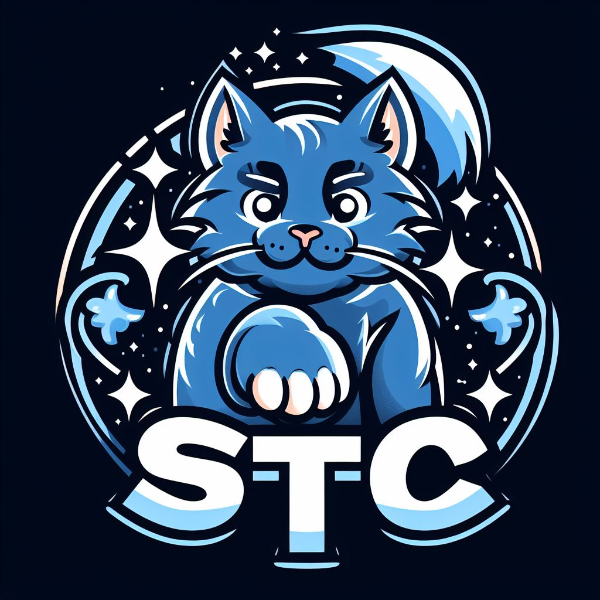

# Good Dads: Sparkling Tom Cats Hackathon Project

This project is a comprehensive solution consisting of a Companion App, an Admin Web App, and several miscellaneous features. 

## Getting Started

These instructions will get you a copy of the project up and running on your local machine for development and testing purposes.

### Prerequisites

- Install Node.js and npm
- Install Angular CLI
- Google account for accessing Google Forms API

### Installing

1. Clone the repository
2. Navigate to the project directory
3. Run `npm install` to install dependencies
4. Run `ng serve` to start the development server

## Tasks

### MVP Tasks

- [ ] Set up Angular project
- [ ] Create basic components (Login, Dashboard, etc.)
- [ ] Integrate Google Forms API
    - [ ] Create a new project in Google Cloud Console
    - [ ] Enable Google Forms API for the project
    - [ ] Generate API key and OAuth 2.0 Client ID
    - [ ] Implement API calls in Angular service
- [ ] Implement form submission functionality
- [ ] Implement form response retrieval and display functionality
- [ ] Implement time-based surveys and quizzes
    - [ ] Design and implement survey/quiz component
    - [ ] Implement timer functionality
    - [ ] Implement survey/quiz submission functionality

### Stretch Goals

- [ ] Create a custom admin interface
    - [ ] Design and implement admin dashboard
    - [ ] Implement admin authentication
    - [ ] Implement form creation and management in admin dashboard
- [ ] Integrate AI for extra-curricular tasks
    - [ ] Choose suitable AI technology (e.g., Langchain)
    - [ ] Implement AI integration in Angular service
    - [ ] Create Python scripts for AI tasks
    - [ ] Set up communication between Angular app and Python scripts

## Authors

* **JugglingDev** - [Github](https://github.com/jugglingdev)
* **Abem93** - [Github](https://github.com/abem93)
* **ZackBradshaw** - [Github](https://github.com/ZackBradshaw)
* **Desace1938** - [Github](https://github.com/Desace1938)

## License

This project is licensed under the MIT License - see the [LICENSE.md](LICENSE.md) file for details

## Acknowledgments

* Hat tip to anyone whose code was used
* Inspiration
* etc
